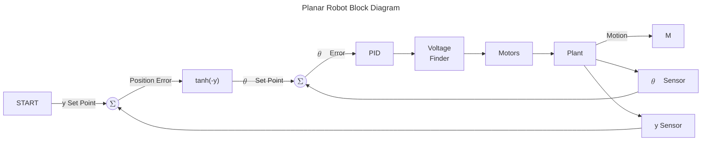
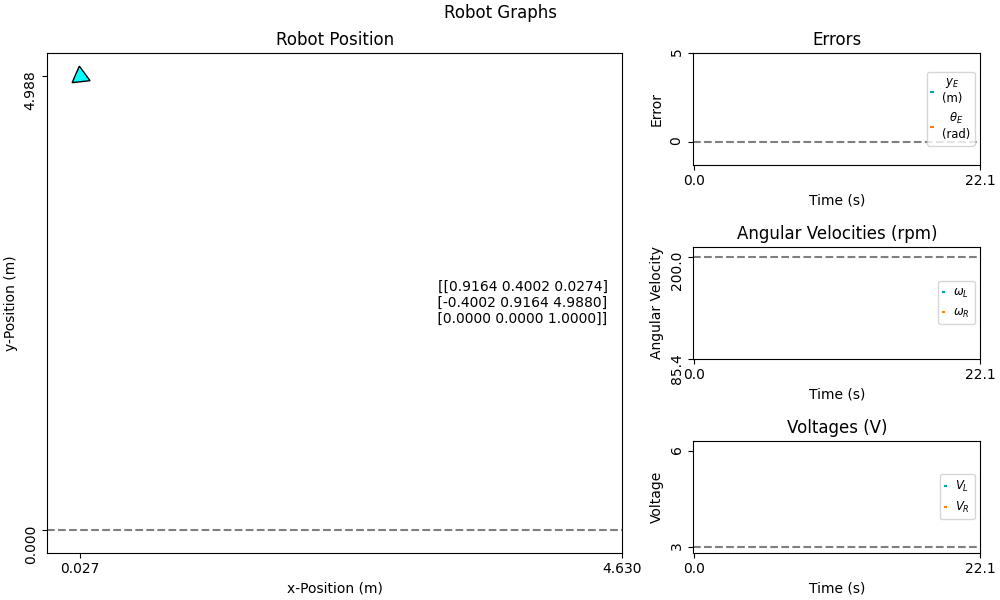
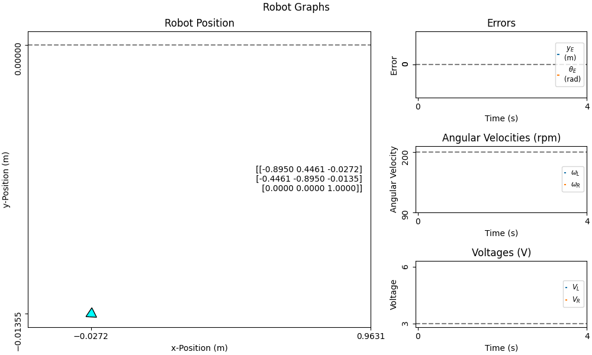

#### POLYTECHNIC UNIVERSITY OF PUERTO RICO

### DEPARTMENT OF MECHANICAL ENGINEERING

### AUTOMATED SYSTEMS AND ROBOTICS 1

#### ME3082-39

### Exam 1: Differential Planar Robot Simulator

#### Gabriel Diaz

##### #121350

##### 2026-01-31

# Abstract
This exam project consisted of creating a planar robot control simulation with gaussian noise in Python in order to demonstrate the student's understanding of robotic design and data transfer between subsystems (Python modules), as well as proficiency in the Python language.
The simulation was succesfully constructed, implementing a PI controller to guide the roboto toward a chosen y-coordinate and a positive x-direction, successfully convering even in high-noise configurations.
The simulation is user-editable and generates animated plots to present the robot's position, errors, wheel speeds, and motor voltages.

# Table of Contents
1. [Introduction](#introduction)
1. [Assumptions](#assumptions)
1. [Data Structures](#data-structures)
1. [Motor](#motor)
1. [Kinematics](#kinematics)
1. [Sensor](#sensor)
1. [Controller](#controller)
1. [Plots](#plots)
1. [Simulator](#simulator)
1. [Experimental Results](#experimental-results)
1. [Discussion](#discussion)
1. [Reflection](#reflection)
1. [References](#references)

# Introduction
A common trait in all multi-file robotics projects is that some communication protocol must be implemented to permit data transfer between files.
The Robotics Operating System 2 (ROS2) is a popular communication protocol for modern robotics projects;
however, it is entirely possible to create a communication protocol through object-oriented programming. 
This exam project uses Python to create a communication protocol for a planar robot simulaiton.

## System Overview
A planar robot simulation incorporates several modules that handle one portion of the total simulation.
These modules can manage a physical system, a piece of hardware, a frontend display, a mathematical model, declare how data will be transfered between modules, or glue modules together.

The modules in this project are tabularized below:

|Module|Description|Input|Output|
|:-:|:-:|:-:|:-:|
|Data Structures|Defines the data packets to be exchanged between modules|---|---|
|Motor|Models a physical motor of the robot.|Voltage|Angular Speed|
|Kinematics|Models the underlying kinematic physics of the robot.|Position, angular velocities|New position|
|Sensor|Models an encoder and its noise.|Motor angular velocity|Noisy angular velocity|
|Control|Implements a mathematical model to correct errors in the robot's position.|Set point, current pose|Voltages for left and right motors.|
|Plots|Constructs the graphical frontend of the simulation.|---|---|
|Simulator|Glues all the modules together to run the simulation from one file.|---|---|

# Assumptions
- Motor:
    1. Motor torque is constant.
    1. The robot's motors are identical.
    1. The motor is 100% efficient.
- Sensor:
    1. The noise processed by [sensor.py](sensor.py) accounts for all extraneous variables in addition to usual sensor noise. 
    1. Actual sensor noise in need of filtering is negligible.
    1. Sensor noise can be approximated as gausian noise with a given mean and a standard deviation proportional to the robot's wheel angular velocities.
- Kinematics:
    1. The robot's kinematics are approximately linear between timestamps.
    2. There is no slip between the robot's wheels and the ground.
    1. The robot's centroid lies on the mid-line between its wheels.

# Data Structures
The [Data Structures](data_structures.py) module is responsible for defining the way in which data will be exchanged between other modules. It is mostly a type hint reference module, but it does create a more rigid structure for creating the screw and pose arrays. 

# Motor
The differential robot has two motors, each controlling one wheel.
The [motor.py](motor.py) module is responsible for handing a single motor---it is instantiated twice by the main simulation to manage the left and right motors independently.

The Motor module receives its characteristic parameters on instantiation to calculate its voltage-omega relation. Thereafter, a Motor object may be called to convert a given voltage into an angular velocity.

## Assumptions
1. Motor torque is constant.
1. The robot's motors are identical.
1. The motor is 100% efficient.

## Model
A DC motor can be electrically modeled as a resistor, an inductor, and a voltage source in series:

<figure>
    
    <figcaption>DC motor electrical circuit.</figcaption>
</figure>

Where:

$$
T = IK_{T}\\
EMF = E = \omega K_{E}
$$

And the values $V$, $R$, $L$, and $T$ are known constants. Applying Kirchoff's Voltage Law to the circuit yields:

$$
V = IR + L \frac{dI}{dt} + \omega K_{E}
$$

Since torque is constant, and current is a function of torque, this further simplifies to:

$$
V = \frac{TR}{K_{T}}+\omega K_{E}
$$

Solving for $\omega$:

$$
\omega = \frac{V}{K_{E}} - \frac{TR}{K_{T}K_{E}}
$$

For a perfectly efficient motor, the torque and emf constants are equal, such that:

$$
\omega = \frac{V}{k} - \frac{TR}{k^2} = mV - b \\
m = \frac{1}{k}, \quad b = \frac{TR}{k^2}
$$

The relation between motor angular velocity and motor voltage is therefore linear.
The constants $m$ and $b$ can be determined upon instantiation of the motor, and the angular velocity $\omega$ can later be found for any given voltage.

## Parameters
Instantiating a motor object with the Motor module requires the following parameters:

|Parameter|Symbol|Value|Unit|
|:-:|:-:|:-:|:-:|
|Torque|$T$|0.1500|$Nm$|
|Resistance|$R$|0.9470|$\Omega$
|Motor Constant|$k$|0.2604|$\frac{Vs}{rad}$
|Minimum Voltage|$V_{Min}$|6.0000|$V$|
|Maximum Voltage|$V_{Max}$|3.0000|$V$|

# Kinematics
The robot's kinematics are governed by its wheel angular velocities.
Because of the perpendicular distance between wheels, a difference between wheel angular velocities in the robot will cause it to rotate about its centroid.
The [kinematics.py](kinematics.py) module is responsible for computing the robot's position with given wheel angular velocities and a known sample time
(provided during instantiation). 
The module computes a difference in position and adds it to its previous position, with an initial poisition provided on instantiation.

## Assumptions
1. The robot's kinematics are approximately linear between timestamps.
2. There is no slip between the robot's wheels and the ground.
1. The robot's centroid lies on the mid-line between its wheels.

## Model

### Coordinate System
The coordinate system of the robot uses the following coordinate directions:
- +y &rarr; Up
- +x &rarr; Left
- +$\theta$ &rarr; Counterclockwise

Given this, the equations for kinematics at constant acceleration (linear) are:

$$
\begin{rcases}
x_{i+1} = x_i + V_{x}\delta t\\
y_{i+1} = y_i + V_{y}\delta t\\
\end{rcases}
\quad
V = \sqrt{V_{x}^2 + V_{y}^2}\\
$$$$
\theta_{i+1} = \theta_i + \omega\delta t
$$

Where $V$ is the robot's linear velocity at its centroid, and $\omega$ is its angular velocity about its centroid. These values are related to the wheel angular velocities by:

$$
V =  \frac{r}{2} \times ( \omega_{Wheel}^{Left} + \omega_{Wheel}^{Right} )\\
V_{x} = V\cos(\theta_{i})\\
V_{y} = V\sin(\theta_{i})\\
$$$$
\omega = \frac{2r}{L} \times ( \omega_{Wheel}^{Right} - \omega_{Wheel}^{Left} )
$$
Where $r$ is the wheel radius and $L$ is the perpendicular distance between wheels.

With these equations, it is possible to find the robot's next position if its geometry and timestamp are known and its current angular velocities are given.

## Parameters
The Kinematics model is instantiated with the following parameters:

|Parameter|Symbol|Value|Unit|
|:-:|:-:|:-:|:-:|
|Sample Time|$\delta t$|0.10|$s$|
|Wheel Radius|$r$|0.02|$m$
|Differential|$L$|0.10|$m$
|Initial x-Position|$x_{o}$|0.00|$V$|
|Initial y-Position|$y_{o}$|---|$V$|
|Initial Orientation|$\theta_{o}$|---|$V$|

# Sensor
The [Sensor](sensor.py) module of the robot is in charge of modeling extraneous variables, simulating an encoder. It incorporates sensor noise and external forces together as gausian noise that is added to a set of a given wheel angular velocity.

Two sensor objects are instantiated: one for each encoder.

## Assumptions
1. The noise processed by [sensor.py](sensor.py) accounts for all extraneous variables in addition to usual sensor noise. 
1. Actual sensor noise in need of filtering is negligible.
1. Sensor noise can be approximated as gausian noise with a given mean and a standard deviation proportional to the robot's wheel angular velocities.

## Model
The noise generated by the sensor is randomly sampled from a gaussian distribution defined by a instantiaed mean and a calculatedstandard deviation.
To better represent how robot speed can affect the magnitude of external forces
(e.g. bumps on the road),
the actual standard deviation used by the Sensor module is computed using the robot's current wheel angular velocity and the instantiated standard deviation multiplier.

The underlying equation of the Sensor module is:

$$
\omega_{New} = \omega_{Ideal} + Gaus(\mu, \quad \sigma_{Mult} \times \omega_{Ideal})
$$

# Controller

The control system is the most important component of the robot---without it, the robot will never converge on the desired position. The robot is given  single set-point: a y-coordinate.
An error will be calculated between the set point an the actual position to determine the motor voltages needed to correct the robot's path.
The orientation set point is determined by the error; furthermore, the controller attempts to direct the robot toward the positive x direction. 

To ensure a positive x direction, the controller must ensure the orientation never aims toward the negative x direction, that is:

$$
-\frac{\pi}{2} \leq \theta_{Set} \leq \frac{\pi}{2}
$$

Furthermore, the relation between $\theta_{Set}$ and $y_{Err}$ must be:

$$
\theta_{Set}(y_{Err} \to \infty) = - \frac{\pi}{2}\\
\theta_{Set}(y_{Err} \to 0) = 0\\
\theta_{Set}(y_{Err} \to - \infty) = \frac{\pi}{2}\\
$$

Two functions that satisfy these requirements for the set orientation are the $arctan(-x)$ and $\frac{\pi}{2}tanh(-x)$

## Arctangent vs Hyperbolic Tangent
Since both the arctangent and the hyperbolic tangent of the negative y-error satisfy the orientation setpoint requirements, the choice comes down to the function that converges more quickly by default. 
The faster function points toward $0$ only when the error is small and reaches $\pm \frac{\pi}{2}$ quickly.

Mathematically, this can be found by analyzing the derivatives of the two functions; however, it is very easy to visually determine the steeper derivative by plotting the two functions:

<figure>
    
    <figcaption>Arctangent and Hyperbolic Tangent Comparisson</figcaption>
</figure>

It can be seen that the hyperbolic tangent function reactes $\pm \frac{\pi}{2}$ faster than the arctangent function, so it is the better choice for the robot's control system.

## PID Tuning
The set orientation is compared to the robot's current orientation, producing an error. This error is then passed through a PID tuner. The control constants are provided by the user upon instantiation. 

$$
Proportional: \quad \theta_{Err,Pi} = k_{P} \theta_{Err,i}\\
Integral: \quad \theta_{Err,Ii} = \theta_{Err,Ii-1} + k_{I}\theta_{Err,i} \delta t\\
Derivative: \quad \theta_{Err,Di} = k_{D} \frac{\theta_{Err,i}-\theta_{Err,i-1}}{\delta t}\\
$$

Summing these modified errors yields a net modified PID error that can be used to find the appropriate motor voltages.

## Controlling Motor Voltage
Since orientation change is induced by a voltage difference between motors, a relation betwen both motor voltages and the orientation error must be defined to successfully correct the possiton error. For simplicity, it is decided that at any given time one of the motors will operate at a set voltage, provided during instatiation.

The other wheel will operate at a lower voltage determined by the control system.
This voltage must exist between the minimum allowable voltage and the set voltage
(which itself must be no greater than the maximum allowable motor voltage):

$$
V_{New} = V_{set} - \alpha V_{Cap}; \quad V_{Cap} = V_{Max} - V_{Min}
$$

Furthermore, it is easy to determine which wheel operates at the set voltage, and which wheel operates at the control voltage:

$$
y_{Err} > 0 \to V_{Left}=V_{Set} \quad \& \quad V_{Right} = V_{New}\\
y_{Err} = 0 \to V_{Left} = V_{Right} = V_{Set}\\
y_{Err} < 0 \to V_{Left}= V_{New} \quad \& \quad V_{Right} = V_{set}
$$

By using the orientation error in the robot-omega-and-wheel-omegas relation, then using the voltage-omega relation, it is possible to find the value of $\alpha$:

$$
\omega = \frac{\theta_{Err}}{\delta t} = \frac{2r}{L}(\omega_{Set} - \omega_{New}); \quad \omega_{Set} = mV_{set} - b; \quad \omega_{New} = m(V_{Set} - \alpha V_{Cap}) - b)\\
\omega = \frac{2r}{L}(\alpha V_{Cap})\\
\alpha = \frac{L}{2rV_{Cap}} \frac{\theta_{Err}}{\delta t}=\beta \theta_{Err}
$$

These new voltages can then be passed to the motor for the next iteration.

## Parameters
The Controller model is instantiated with the following parameters:

|Parameter|Symbol|Value|Unit|
|:-:|:-:|:-:|:-:|
|Motor Data|---|---|---|
|Kinematic Data|---|---|---|
|Proportional Constant|$k_{P}$|0.5|---|
|Integral Constant|$k_{I}$|2.0|$\frac{1}{s}$|
|Derivative Constant|$k_{D}$|0.0|$s$|
|Position Setpoint|$y_{Set}$|0.0|m|
|Voltage Setpoint|$V_{Set}$|6.0|V|

# Plots
The [Plots](plots.py) module is the frontend of the project. It takes the finalized simulation data and plots it. The displayed data are:
1. x-y Position Map
    - Includes the SE(2) pose matrix of the robot.
1. $y_{Err}$ and $\theta_{Err}$ vs. Time
1. Wheel Angular Velocities vs. Time
1. Motor Voltages vs Time

This data is arranged in a matplotlib gridspec, showing the x-y map as the main plot, and the rest on the right. The plots themselves are animated and saved in /GIFs/Plot.gif .

# Simulator
The [Simulator](simulator.py) module is responsible for "gluing" all of the other modules together.
It declares the simulation values, following the structure from the Data Structures module.
The set data is then used to instantiate objects from the other modules. 

Aside from parameter declarations, the only code unique to the Simulator module is a while loop responsible for calling object methods in correct order to produce each iteration of the robot. 
The loop continues after the simulation either converges below a given tolerance, or the simulation exceeds a set limit of iterations. 
Both the tolerance and maximum iterations are user defined. Since the robot uses both a set-point error and an internal orientation error, convergence is determined by comparing the error magnitude to the tolerance:

$$
\exists \quad Convergence \space if: \sqrt{y_{Err}^{2}+ \theta_{Err}^{2}} \le Tolerance
$$

Regardless of whether or not convergence is achieved, the number of iterations is displayed in the terminal, and the Plots module is then called to create and save the animation of the robot's plots.

# Experimental Results
The simulation was tested for several configurations.
PID constants were experimentally selected;
the final selection of constants are displayed in the Control section's parameters. 
Curiously, implementing derivative control action to the simulation induced erratic behavior that would not converge. 

Configurations are classed in three ways:
### 1. Noise

Level of the standard deviation multiplier; mean is left at 0.00.

|Level|Number|
|:-:|:-:|
|None|0.00|
|Nominal|~0.25|
|High|~5.0|

 ### 2. Error
 
 Position or Orientation error at simulation start.

|Level|Position|Orientation|
|:-:|:-:|:-:|
|Low|~0.0 m|~0.0 rad|
|Moderate|~1.0 m|~1.0 rad|
|High|~5.0 m|~$\pi/2$ rad|

### 3. Saturation

Scenarios where the error is so high that the voltage difference reaches its maximum allowable value at some point in the simulation.

## Animations
Six tests were formally animated to demonstrate the behaviors of the simulation at different configurations with the final PID constants:

<figure>
    
    <figcaption>Nominal Noise, Moderate Error</figcaption>
</figure>

<figure>
    
    <figcaption>High Noise, High Negative Error</figcaption>
</figure>

<figure>
    
    <figcaption>High Noise, High Positive Error</figcaption>
</figure>

<figure>
    
    <figcaption>Saturation, No Noise, Low Error</figcaption>
</figure>

<figure>
    
    <figcaption>Saturation, No Noise, Moderate Error</figcaption>
</figure>

<figure>
    
    <figcaption>Saturation, No Noise, High Error</figcaption>
</figure>

From the animations, it can be seen that the robot is able to successfully converge even with high noise and a high error. 

# Discussion
The simulation can successfully converge from any error and even high noise to the given set point.
However, its error correction is very slow at low errors, even with the hyperbolic tangent model and integral control action.
Furthermore, the erratic behavior stemming from *any* derivative action at all likely points to an incorrect implementation of a PID controller.
It is possible that applying PID control to the orientation error, rather than a voltage error, could be to blame.

Nevertheless, a planar robot simulator with complete integration between kinematics, control, noise, motors, and plotting modules was successfully created in Python. 

# Reflection

## Data Structures
The Data Structures module, in its current state, is mostly a type hint reference for the other modules, rather than a rigorous or technically useful module.
It could instead be reformatted as either:
1. Abstract classes that define the input attributes and end-user methods accessed by simulator.py.
The modules would then inherit their respective data structure.

1. Data classes that contain all the input values and are themselves passed into their respective module as an object.

## Motor
The Motor module could be streamlined to account for both mothers as a single unified object that takes list inputs.
Instantiating the motors sepparately provides no real benefit but does take up more lines of code.

## Kinematics
The Kinematics module is the highest quality module; it does not need any changes beyond reformatting to impement changes in data_structures.py.

## Sensor
Like the Motor module, the Sensor module could be restructured to implement both sensors as one object instead of being instantiated twice. 
Furthermore, the sensor could take in the Kinematics object as an argument to call upon it internally.
Letting the Sensor module determine the kinematics internally would better represent how an actual robot would perform.

## Control
The most important change needed for the Control module would be debugging its PID.
Derivative action breaking the simulation, even when no noise is present, should not be happening. 
Deriving an equation for a voltage error and implenting PID control to it over an orientation error should be investigated.

A good optimization for the Control module would be passing it the entire motor and kinematic objects during instantiation.
This would link the three objects together and furthermore allow control.py to access the other two objects' methods.

## Plots
The Plots module is currently lackluster.
For one, some of the axis limits and ticks break when the initial position is below the set point.
Several original ideas were not successfully implemented into the plotting of the simulation:
1. In the map, there were supposed to be x- and y- ticks following the robot's current position. 
1. It was desired to display text data of the robot's properties and pose below the map. This turned out far too difficult to pursue.
1. Axes limits being updated in real-time were considered but never implemented to decide which animation looked better.
1. An ideal, no-noise, semi-transparent graph was initially considered but later dropped since noise deviations did not stray too much from the ideal path.

Unfortunately, these features could not have been implemented into the program due to lack of proficiency with the Matplotlib API;
however, they will be pursued for future versions.

# References

[1] "DC Motor Speed: Voltage and Torque Relationships," Precision Microdrives. [Online]. Available: https://www.precisionmicrodrives.com/dc-motor-speed-voltage-and-torque-relationships.

[2] "Matplotlib documentation," Matplotlib Development Team. [Online]. Available: https://matplotlib.org/stable/index.html. [Accessed: Feb. 5, 2026].

[3] "Understanding PID Control," YouTube. [Online]. Available: https://www.youtube.com/watch?v=wkfEZmsQqiA&list=PLn8PRpmsu08pQBgjxYFXSsODEF3Jqmm-y. [Accessed: Feb. 5, 2026].

