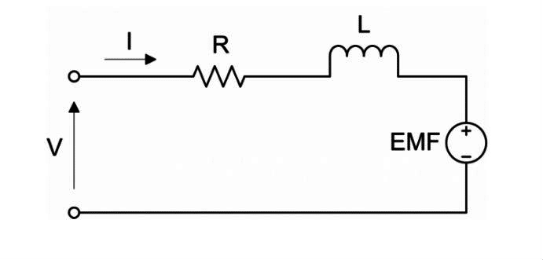

#### POLYTECHNIC UNIVERSITY OF PUERTO RICO

### DEPARTMENT OF MECHANICAL ENGINEERING

### AUTOMATED SYSTEMS AND ROBOTICS 1

#### ME3082-39

### Exam 1: Differential Planar Robot Simulator

#### Gabriel Diaz

##### #121350

##### 2026-01-31

# Abstract

# Introduction
A common trait in all multi-file robotics projects is that some communication protocol must be implemented to permit data transfer between files.
The Robotics Operating System 2 (ROS2) is a popular communication protocol for modern robotics projects;
however, it is entirely possible to create a communication protocol through object-oriented programming. 
This exam project uses Python to create a communication protocol for a planar robot simulaiton.

## System Overview
A planar robot simulation incorporates several modules that handle one portion of the total simulation.
These modules can manage a physical system, a piece of hardware, a frontend display, a mathematical model, declare how data will be transfered between modules, or glue modules together.

The modules in this project are tabularized below:

|Module|Description|Input|Output|
|:-:|:-:|:-:|:-:|
|Data Structures|Defines the data packets to be exchanged between modules|---|---|
|Motor|Models a physical motor of the robot.|Voltage|Angular Speed|
|Kinematics|Models the underlying kinematic physics of the robot.|Position, angular velocities|New position|
|Sensor|Models an encoder and its noise.|Motor angular velocity|Noisy angular velocity|
|Control|Implements a mathematical model to correct errors in the robot's position.|Set point, current pose|Voltages for left and right motors.|
|Plots|Constructs the graphical frontend of the simulation.|---|---|
|Simulator|Glues all the modules together to run the simulation from one file.|---|---|

# Assumptions
1. Motor torque is constant.
1. The robot's motors are identical.
1. The noise processed by [sensor.py](sensor.py) accounts for all extraneous variables in addition to usual sensor noise. 
1. Actual sensor noise in need of filtering is negligible.
1. Sensor noise can be approximated as gausian noise with a given mean and a standard deviation proportional to the robot's wheel angular velocities.

# Motor
The differential robot has two motors, each controlling one wheel.
The [motor.py](motor.py) module is responsible for handing a single motor---it is instantiated twice by the main simulation to manage the left and right motors independently.

The Motor module receives its characteristic parameters on instantiation to calculate its voltage-omega relation. Thereafter, a Motor object may be called to convert a given voltage into an angular velocity.

## Model
A DC motor can be electrically modeled as a resistor, an inductor, and a voltage source in series:

<figure>
    
    <figcaption>DC motor electrical circuit.</figcaption>
</figure>

Where:
$$
T = IK_{T}\\
EMF = E = \omega K_{E}
$$

And the values $V$, $R$, $L$, and $T$ are known constants. Applying Kirchoff's Voltage Law to the circuit yields:
$$
V = IR + L \frac{dI}{dt} + \omega K_{E}
$$

Since torque is constant, and current is a function of torque, this further simplifies to:
$$
V = \frac{TR}{K_{T}}+\omega K_{E}
$$

Solving for $\omega$:
$$
\omega = \frac{V}{K_{E}} - \frac{TR}{K_{T}K_{E}}
$$

For a perfectly efficient motor, the torque and emf constants are equal, such that:
$$
\omega = \frac{V}{k} - \frac{TR}{k^2} = mV - b \\
m = \frac{1}{k}, \quad b = \frac{TR}{k^2}
$$

The relation between motor angular velocity and motor voltage therefore linear. The linear constants $m$ and $b$ can be determined upon first instantiation of the motor, and the angular velocity $\omega$ can later be found for any given voltage.

## Parameters
Instantiating a motor object with the Motor module requires the following parameters:

|Parameter|Symbol|
|:-:|:-:|
|Torque|$T$|
|Resistance|$R$|
|Motor Constant|$k$|
|Minimum Voltage|$V_{Min}$|
|Maximum Voltage|$V_{Max}$|

# Kinematics

## Assumptions

## Model

# Sensor

## Model
- Sensor noise is negligible; code noise actually simulates external interference.

### The Proportional Standard Deviation

## Implementation

# Controller

## Assumptions

## Error Modeling

### arctangent vs hiperbolic tangent
put graphs here showing atan(-x) and tanh(-x)

## PID Tuning

### Proportional Control

### Integral Control

### Derivative Control

# Experimental Results

# Discussion

# Reflection

# Bibliography

